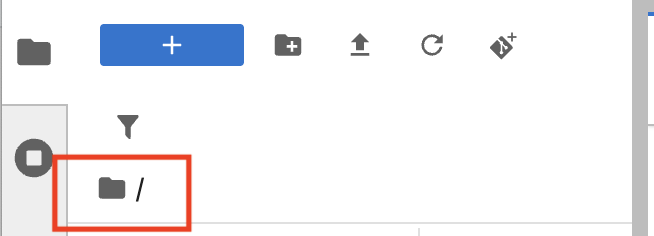

::: {.callout-note icon=false}

## Learning Objectives

- Learn how to use the Git GUI in JupyterLab
- Practice 4 basic Git/GitHub skills: cloning, committing, push/pull

## Prerequisites

- Read [Intro to Git](topics-skills/02-git.html)
- Have a [GitHub](https://github.com/) account
- [Git Authentication](topics-skills/02-git-authentication.html)

:::

## Create a GitHub account

For access to the NMFS Openscapes JupyterHub, you will need at GitHub account. See the main HackHour
page on how to request access (NOAA staff). For NMFS staff, you can look at the [NMFS OpenSci GitHub Guide](http://nmfs-opensci.github.io/GitHub-Guide/#create-a-github-user-account)
information for how to create your user account and you will find lots of information on the
[NMFS GitHub Governance Team Training Page](https://sites.google.com/noaa.gov/nmfs-st-github-governance-team/training) (visible only to NOAA staff).

## Setting up Git Authentication

Before we can work with Git in the JupyterHub, your need to authenticate. Do the steps here: [Git Authentication](topics-skills/02-git-authentication.html)

## Git extension in JupyterLab

When the instructions say to use or open or click the Git GUI, look here:


## The Key Skills

* Skill 1: Create a blank repo on GitHub
* Skill 2: Clone your **GitHub** repo
* Skill 3: Make some changes and commit those local changes
* Skill 4: Push the changes to GitHub

* Skill 1b: Copy someone else's GitHub repository

## Let's see it done!

### Skill 1: Create a blank repo on GitHub

1. Click the + in the upper left from YOUR GitHub account (https://www.github.com/yourusername).
2. Give your repo the name `Test` and make sure it is public.
3. Click new and check checkbox to add the Readme file and `.gitignore`
4. Copy the URL of your new repo. It's in the browser where you normally see a URL.

### Skill 2: Clone your repo

First make sure you are at the home directory level. Look at the folder icon under the blue launcher
button. It should show, folder icon only like in this image. If not, then click on the folder icon.



1. Copy the URL of your repo. `https://www.github.com/yourname/Test`
2. Click on the git icon and then click "Clone a Repository"
    
3. Paste in the URL of your repo from Step 1
4. Click Clone. You can stay with the defaults for the checkboxes.

[Show me](https://youtu.be/Anw1oXmwMTM)

### Skill 3: Make some changes and commit your changes

This writes a note about what changes you have made. It also marks a 'point' in time that you can go back to if you need to.

1. Click on the README.md file in the Test repo.
2. Make some changes to the file.
3. Click the Git icon (in left navbar), and stage the change(s) by checking the "+" next to the files listed.
4. Add a commit message in the box.
5. Click the Commit button at bottom.

[Show me](https://youtu.be/-V9GdXNXalQ)

### Skill 4: Push changes to GitHub / Pull changes from GitHub

To push changes you committed in Skill #3

1. From Git icon, look for the little cloud at the top. It is rather small. Click that to push changes.

To pull changes on GitHub that are not on your local computer:

1. Make some changes directly on GitHub (not in JupyterLab)
2. From Git icon, click on the little cloud with a down arrow.

### Activity 1

1. Make a copy of README.md
2. Rename it to <youname>.md
3. Add some text.
4. Stage and commit the added file.
5. Push to GitHub.

[Show me](https://youtu.be/ejmkkjWJ_Es)

### Activity 2

1. In the Test repo, create a file called to `<yourname>.md`.
2. Stage and then commit that new file.
3. Push to GitHub.
4. Make some more changes and push to GitHub.

### Activity 3

You can copy your own or other people's repos^[This is different from forking. There is no connection to the original repository.].

1. In a browser, go to the GitHub repository <https://github.com/RWorkflow-Workshops/Week5>
2. Copy its URL.
3. Navigate to your GitHub page: click your icon in the upper right and then 'your repositories'
4. Click the `+` in top right and click `import repository`. Paste in the URL and give your repo a name.
5. Use Skill #1 to clone your new repo to JupyterLab

## Clean up after you are done

1. Open a Terminal
2. Type
   
   ```
   cd ~
   rm -rf Test
   rm -rf Week5
   ```

