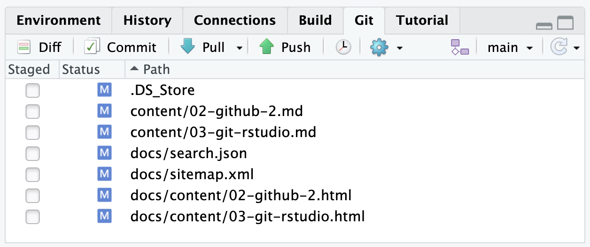

::: {.callout-note icon=false}

## Learning Objectives

- Learn how to use the Git GUI in RStudio
- Practice 4 basic Git/GitHub skills: cloning, committing, push/pull

## Prerequisites

- Read [Intro to Git](topics-skills/02-git.html)
- Have a [GitHub](https://github.com/) account
- [Git Authentication](topics-skills/02-git-authentication.html)

:::

## Create a GitHub account

For access to the NMFS Openscapes JupyterHub, you will need at GitHub account. See the main HackHour
page on how to request access (NOAA staff). For NMFS staff, you can look at the [NMFS OpenSci GitHub Guide](http://nmfs-opensci.github.io/GitHub-Guide/#create-a-github-user-account)
information for how to create your user account and you will find lots of information on the
[NMFS GitHub Governance Team Training Page](https://sites.google.com/noaa.gov/nmfs-st-github-governance-team/training) (visible only to NOAA staff).

## Setting up Git Authentication

Before we can work with Git in the JupyterHub, your need to do some set up. Do the steps here: [Git Authentication](topics-skills/02-git-authentication.html)

## Git tab in RStudio

When the instructions say to use or open or click the Git tab, look here:



## The Key Skills

* Skill 1: Create a blank repo on GitHub
* Skill 2: Clone your **GitHub** repo to RStudio
* Skill 3: Make some changes and commit those local changes
* Skill 4: Push the changes to GitHub

* Skill 1b: Copy someone else's GitHub repository

## Let's see it done!

### Skill 1: Create a blank repo on GitHub

1. Click the + in the upper left from YOUR GitHub page.
2. Give your repo the name `Test` and make sure it is public.
3. Click new and check checkbox to add the Readme file and `.gitignore`
4. Copy the URL of your new repo. It's in the browser where you normally see a URL.

[Show me](https://youtu.be/_QszqhWW_Mg)

### Skill 2: Clone your repo to the RStudio

In RStudio we do this by making a new project.

1. Copy the URL of your repo. `https://www.github.com/yourname/Test`
2. File > New Project > Version Control > Git
3. Paste in the URL of your repo from Step 1
3. Check that it is being created in your Home directory which will be denoted `~` in the JupyterHub.
4. Click Create.

[Show me](https://youtu.be/GObjzx6v6rU)


### Skill 3: Make some changes and commit your changes

This writes a note about what changes you have made. It also marks a 'point' in time that you can go back to if you need to.

1. Make some changes to the README.md file in the Test repo.
2. Click the Git tab, and stage the change(s) by checking the checkboxes next to the files listed.
2. Click the Commit button.
3. Add a commit comment, click commit.

[Show me](https://youtu.be/9XfChAPpVm4)

### Skill 4: Push changes to GitHub / Pull changes from GitHub

To push changes you committed in Skill #3

1. From Git tab, click on the Green up arrow that says Push.

To pull changes on GitHub that are not on your local computer:

1. Make some changes directly on GitHub (not in RStudio)
2. From Git tab, click on the down arrow that says Pull.

[Show me](https://youtu.be/wcQNQH0matE)

### Activity 1

In RStudio,

1. Make a copy of README.md
2. Rename it to <youname>.md
3. Add some text.
4. Stage and commit the added file.
5. Push to GitHub.

[Show me in RStudio](https://youtu.be/xUbxqzp7Rss)

### Activity 2

1. Go to your Test repo on GitHub. `https://www.github.com/yourname/Test`
2. Create a file called `test.md`.
2. Stage and then commit that new file.
3. Go to RStudio and pull in that new file.

### Activity 3

You can copy your own or other people's repos^[This is different from forking. There is no connection to the original repository.].

1. In a browser, go to the GitHub repository <https://github.com/RWorkflow-Workshops/Week5>
2. Copy its URL.
3. Navigate to your GitHub page: click your icon in the upper right and then 'your repositories'
4. Click the `+` in top right and click `import repository`. Paste in the URL and give your repo a name.
5. Use Skill #1 to clone your new repo to RStudio and create a new project

## Clean up after you are done

1. Open a Terminal
2. Type
   
   ```
   cd ~
   rm -rf Test
   rm -rf Week5
   ```


