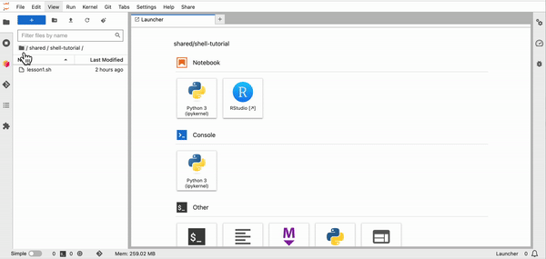
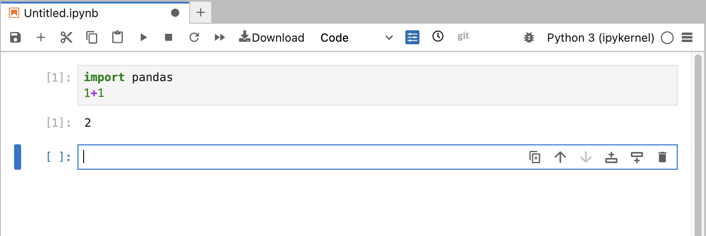

::: {.callout-note icon=false}

## Learning Objectives

- Basic navigation within JupyterLab
- How to restart the JupyterHub
- How to open a terminal window

:::

When you start the JupyterHub, you will be in JupyterLab. 

## Terminal/Shell

Log into the JupyterHub. If you do not see something like this

Then go to File > New Launcher

Click on the "Terminal" box to open a new terminal window.

### Shell or Terminal Basics

If you have no experience working in a terminal, check out this self-paced lesson
on running scripts from the shell: [Shell Lesson from Software Carpentry](http://swcarpentry.github.io/shell-novice/)

Basic shell commands: 

-   `pwd` where am I
-   `cd nameofdir` move into a directory
-   `cd ..` move up a directory
-   `ls` list the files in the current directory
-   `ls -a` list the files including hidden files
-   `ls -l` list the files with more info
-   `cat filename` print out the contents of a file
-   `rm filename` remove a file
-   `rm -r directoryname` remove a directory
-   `rm -rf directoryname` force remove a directory; careful no recovery

Close the terminal by clicking on the X in the terminal tab.

## File Navigation

In the far left, you will see a line of icons. The top one is a folder and allows us to move around our file system.

1.  Click on file icon below the blue button with a `+`. Now you see files in your home directory.

3.  Click on the folder icon that looks like this. Click on the actual folder image. 

    This shows me doing this
    
    
    
4. Create a new folder. 

    * Next to the blue rectange with a +, is a grey folder with a +. Click that to create a new folder, called `lesson-scripts`.

    
    
5. Create a new file

    * Create with File > New > Text file
    * The file will open and you can edit it.
    * Save with File > Save Text

6. Delete a file

    * Delete a file by right-clicking on it and clicking "Delete"
    
## Create a new Jupyter notebook

From Launcher, click on the "Python 3" button, this will open a new Jupyter notebook.

## Basic Jupyter notebook navigation

A Jupyter notebook is a series of cells than can be code (default), markdown or raw text.

Look at the top cell, this is a code cell which I could see if I click on the cell
and look at the top navbar. Next to "Download", it says "Code". I can click that dropdown and change
the cell type to markdown or raw.

To the left of the "Save" icon in the top navbar is a "+". This will add a new cell. 

Within a cell, you will see some icons on the right. Roll over these icons to see what they do.

## Running code in a cell

To run code in a cell, click in the cell and then hit "Shift Return". You can also click "Run" in the 
menu or click the little right arrow in the top navbar above the cells.

## Creating and rendering markdown

Create an new cell (you can click the "+" in the top navbar) and then change to markdown by
clicking the dropdown next to "Download" in the top navbar. Type in some markdown and the run the cell
(see above on how to run cells).

## Running all cells in a notebook

Use the "Run" menu.

## Install packages

Use `pip install` in a cell. This will not persist between sessions.

## Learn more

There are lots of tutorials on JupyterLab out there. Do a search to find content that works for you.

